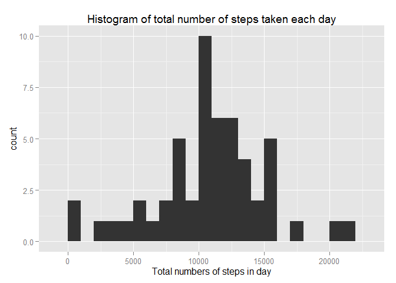
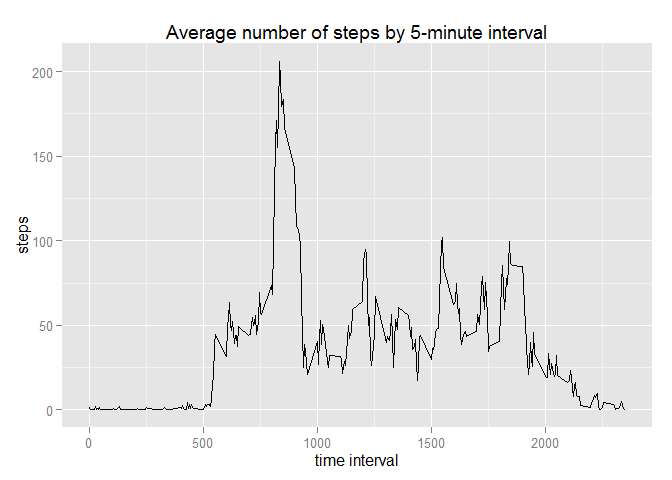
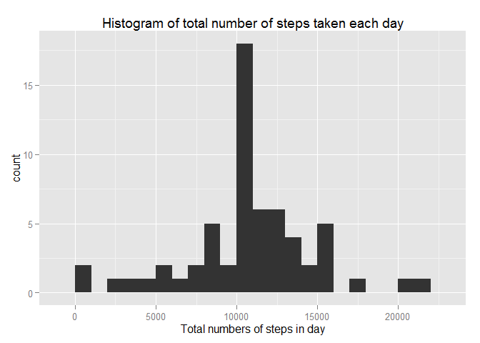
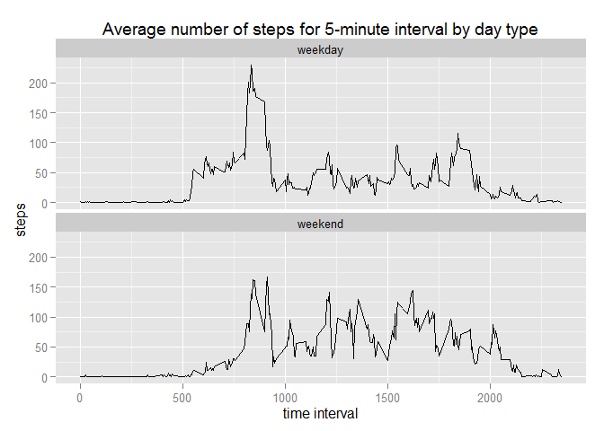

# Reproducible Research: Peer Assessment 1


## Loading and preprocessing the data


```r
unzip(zipfile = "activity.zip", exdir = "data")
activity <- read.csv(file = "data/activity.csv")
```

## What is mean total number of steps taken per day?

### 1. Calculating total number of steps per day:

```r
stepsByDate <- aggregate(steps ~ date, activity, FUN = sum)
```

### 2. Making histogram of total number of steps per each day

```r
library(ggplot2)
```

```
## Warning: package 'ggplot2' was built under R version 3.1.3
```

```r
g <- ggplot(data = stepsByDate, aes(steps))
p <- g + geom_histogram(binwidth=1000) +
         labs(title = "Histogram of total number of steps taken each day") + 
         xlab("Total numbers of steps in day")
p
```

 

**NOTE** According to `binwidth` parameter histogram can looks like different. 
I decided to use binwidth = 1000 due to diagram seems to be more readable.

### 3. Calculating mean and median 

```r
mean(stepsByDate$steps)
```

```
## [1] 10766.19
```

```r
median(stepsByDate$steps)
```

```
## [1] 10765
```

## What is the average daily activity pattern?

### 1. Creating time series plot of the 5-minute interval (x-axis) and the average number of steps taken, averaged across all days (y-axis):

```r
meanStepsByInterval <- aggregate(steps ~ interval, activity, FUN = mean)

g <- ggplot(data = meanStepsByInterval, aes(x = interval, y = steps))
p <- g + geom_line() +
         labs(title = "Average number of steps by 5-minute interval") + 
         xlab("time interval")
p
```

 

### 2. Finding 5-minute interval, on average across all the days in the dataset, contains the maximum number of steps:

```r
meanStepsByInterval[which.max(meanStepsByInterval$steps),1:2]
```

```
##     interval    steps
## 104      835 206.1698
```

## Imputing missing values

### 1. Calculating the total number of missing values in the dataset:

```r
length(activity$steps[is.na(activity$steps)])
```

```
## [1] 2304
```

### 2. Strategy for missing vlue imputing.
Missing values will be replaced my mean value of particular 5-minute interval. 
These values already calculated in `meanStepsByInterval` data set.

### 3. Creating new dataset wit filled steps missing values (`actFilled`)

```r
actFilled <- cbind(activity, meanStepsByInterval$steps)
names(actFilled)[4]<-"meanStepsByInterval"
actFilled$steps[is.na(actFilled$steps)] <- actFilled$meanStepsByInterval[is.na(actFilled$steps)]
```

### 4. Make histogram for new dataset and calculate mean and median.


```r
stepsByDateFilled <- aggregate(steps ~ date, actFilled, FUN = sum)

g <- ggplot(data = stepsByDateFilled, aes(steps))
p <- g + geom_histogram(binwidth=1000) +
         labs(title = "Histogram of total number of steps taken each day") + 
         xlab("Total numbers of steps in day")
p
```

 


Mean and median for dataset without NAs:

```r
mean(stepsByDateFilled$steps)
```

```
## [1] 10766.19
```

```r
median(stepsByDateFilled$steps)
```

```
## [1] 10766.19
```
Mean and median for original dataset (with NAs):

```r
mean(stepsByDate$steps)
```

```
## [1] 10766.19
```

```r
median(stepsByDate$steps)
```

```
## [1] 10765
```

**As a result of missing values imputing `mean` value was not changed. But `median` value was shightly changed.**

## Are there differences in activity patterns between weekdays and weekends?

### 1. Create a new factor variable in the dataset with two levels – “weekday” and “weekend”


```r
# set locale to English to print weekday names in English.
Sys.setlocale("LC_ALL","English")
```

```
## [1] "LC_COLLATE=English_United States.1252;LC_CTYPE=English_United States.1252;LC_MONETARY=English_United States.1252;LC_NUMERIC=C;LC_TIME=English_United States.1252"
```

```r
actFilled$date <- as.Date(actFilled$date)
actFilled$weekDayType <- "weekday"
actFilled$weekDayType[weekdays(actFilled$date) %in% c("Sunday", "Saturday")] <- "weekend"
actFilled$weekDayType <- as.factor(actFilled$weekDayType)
```

### 2. Make plot of time series of 5-minute interval and the avg number of steps across weekdays or weekends


```r
meanStepsByIntervalFilled <- aggregate(steps ~ interval+weekDayType, actFilled, FUN = mean)

g <- ggplot(data = meanStepsByIntervalFilled, aes(x = interval, y = steps))
p <- g + geom_line() +
         facet_wrap(facets = ~ weekDayType, nrow = 2, ncol = 1) +
         labs(title = "Average number of steps for 5-minute interval by day type") + 
         xlab("time interval")
p
```

 


